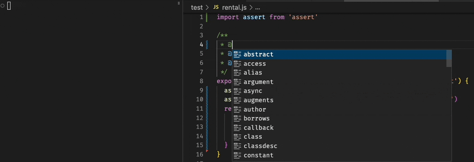

<p align="center">
<br/> <p align="center" style="font-size: 18px;">A software testing framework for humans :) </p>

</p>

---
## What is this?

Pineapple is a test framework designed to remove the cruft from writing unit tests and creating snapshots.


```js
/**
 * Adds numbers together for the sake of demonstrating pineapple.
 * @test 1, 2 returns 3
 * @test '1', 2 throws "Not a number"
 * @param {number} a 
 * @param {number} b
 */
export function add(a, b) {
    if (typeof a !== 'number' || typeof b !== 'number') throw new Error('Not a number')
    return a + b
}
```

Pineapple allows you to embed a few example test-cases in your JSDocs, making it easier to focus on your code and less on defining `it` & `expect` chains. 

When you omit conditions from your test cases, Pineapple will automatically capture the result of your test & snapshot it, making it easier to preserve expected behavior in your applications, and even easier for users to find examples on how to call your code.

### Snapshot Example



## To Install

```
npm i pineapple --save-dev
```
or 
```
yarn add pineapple --dev
```

---

Documentation coming soon.